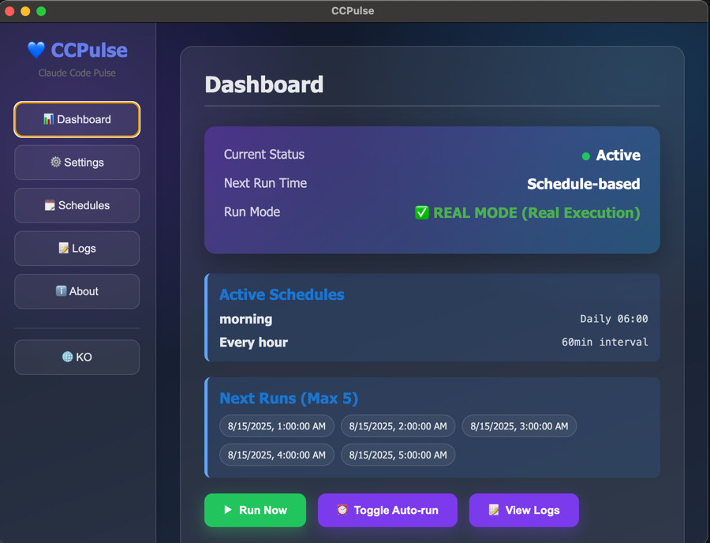
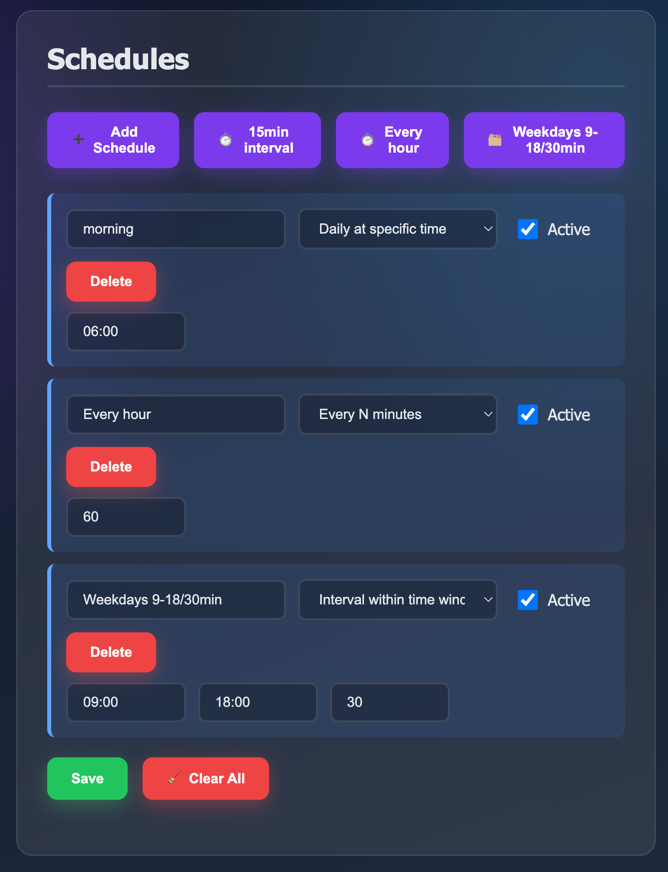
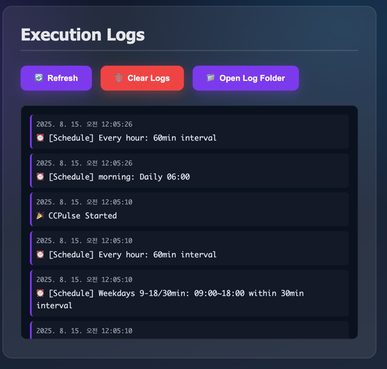
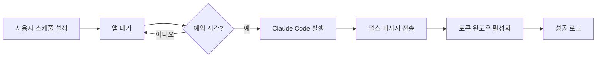

# CCPulse 💙

> Claude Code 토큰 윈도우를 주기적인 펄스로 활성 상태로 유지하세요

[](https://opensource.org/licenses/MIT)
[](https://github.com/renechoi/ccpulse)
[](https://nodejs.org)
[](https://github.com/renechoi/ccpulse)

<!-- 스크린샷 -->
<p>
  
  
</p>
<p>
  
</p>
<p>
  
</p>

## 🌍 언어

**한국어** | [English](README.md)

## 🚀 빠른 시작 (30초 설치)

### macOS/Linux
```bash
curl -fsSL https://raw.githubusercontent.com/renechoi/ccpulse/main/install.sh | bash
```

### Windows
```powershell
iwr -useb https://raw.githubusercontent.com/renechoi/ccpulse/main/install.ps1 | iex
```

### 수동 설치
```bash
git clone https://github.com/renechoi/ccpulse.git
cd ccpulse
npm install
npm start
```

## 💡 왜 필요한가요?

Claude Code는 **첫 사용 시점부터 5시간** 토큰 윈도우가 시작됩니다:
- 오후 3시에 처음 사용 → 저녁 8시에 윈도우 종료(5시간)
- 오전 6시에 처음 사용 → 오전 11시에 윈도우 종료(5시간)

**해결책**: 원하는 시간(예: 오전 6:00)에 가벼운 "Hello" 펄스를 자동 전송해, 5시간 윈도우의 시작점을 업무 시간 등 원하는 시간대에 맞춰 정렬하세요.

## ✨ 주요 기능

- 🕐 **스케줄 관리**: 원하는 시간에 자동 실행
- 🎨 **GUI 인터페이스**: 시각적 인터페이스로 쉬운 설정
- 🌐 **다국어 지원**: 한국어/영어 지원 및 쉬운 전환
- 📊 **실시간 로그**: 실행 상태 모니터링
- 🔄 **Mock/Real 모드**: 실제 실행 전 안전하게 테스트
- 🖥️ **시스템 트레이**: 백그라운드에서 조용히 실행
- ⚡ **다중 스케줄**: 여러 트리거 시간 설정
- 🔔 **알림**: 성공적인 리셋 시 알림

## 📖 사용법

### 1. 초기 설정
- **펄스 시간**: 오전 6:00 (예시)
- **메시지**: "Hello" (사용자 지정 가능)
- **모드**: Mock 모드로 시작 → Real 모드로 전환
- **언어**: 언어 버튼을 클릭하여 전환

### 2. 앱 실행
```bash
# 프로젝트 디렉터리에서
npm install
npm start

# (선택) 데스크톱 바로가기를 만들어 두었다면 더블클릭
```

### 3. 설정 위치
- macOS: `~/Library/Application Support/ccpulse/`
- Linux: `~/.config/ccpulse/`
- Windows: `%APPDATA%/ccpulse/`

## 🛠️ 고급 설정

### 자동 시작 설정
```bash
# macOS
launchctl load ~/Library/LaunchAgents/com.claude.ccpulse.plist

# Linux
systemctl --user enable ccpulse.service

# Windows
# 시작 프로그램에 자동으로 추가됨
```

### 환경 변수
```bash
export CCPULSE_MOCK_MODE=false    # Real 모드 강제
export CCPULSE_AUTO_START=true    # 자동 시작 활성화
export CCPULSE_LANGUAGE=ko        # 기본 언어 설정 (en/ko)
```

### 명령줄 옵션
> 전역 CLI는 아직 번들되지 않았습니다. UI에서 스케줄을 설정해 사용하세요.

## 📋 요구사항

- Node.js 16.0.0 이상
- Claude Code 설치 및 설정 완료
- macOS: Terminal 자동화 권한 필요

## 🤝 기여하기

기여를 환영합니다! Pull Request를 자유롭게 제출해주세요.

1. 저장소 Fork
2. Feature 브랜치 생성 (`git checkout -b feature/AmazingFeature`)
3. 변경사항 커밋 (`git commit -m 'Add some AmazingFeature'`)
4. 브랜치에 Push (`git push origin feature/AmazingFeature`)
5. Pull Request 열기

### 개발 설정
```bash
# 클론 및 설치
git clone https://github.com/renechoi/ccpulse.git
cd ccpulse
npm install

# 개발 모드로 실행
npm run dev

# 테스트 실행
npm test

# 프로덕션 빌드
npm run build
```

## 📝 라이센스

MIT License © 2025 [renechoi](https://github.com/renechoi)

## 🆘 문제 해결

### macOS 권한 문제
```bash
# Terminal 자동화 접근 허용
시스템 설정 > 개인정보 및 보안 > 자동화 > Terminal ✓
```

### Node.js 설치
```bash
# macOS
brew install node

# Ubuntu/Debian
curl -fsSL https://deb.nodesource.com/setup_lts.x | sudo -E bash -
sudo apt-get install -y nodejs

# Windows
# https://nodejs.org 에서 다운로드
```

### 로그 보기
```bash
# 실시간 로그 모니터링
tail -f ~/.config/ccpulse/logs.txt

# 마지막 50줄 확인
tail -n 50 ~/.config/ccpulse/logs.txt
```

### 일반적인 문제

<details>
<summary>macOS에서 앱이 시작되지 않음</summary>

"확인되지 않은 개발자가 배포했기 때문에 열 수 없습니다" 메시지가 나타나면:
```bash
xattr -cr /Applications/CCPulse.app
```
</details>

<details>
<summary>스케줄이 트리거되지 않음</summary>

1. 앱이 시스템 트레이에서 실행 중인지 확인
2. 설정에서 스케줄 시간 확인
3. 실제 실행을 위해 Mock 모드가 비활성화되어 있는지 확인
4. 오류 메시지가 있는지 로그 확인
</details>

## 📊 작동 원리



### 실행 타이밍
- Claude에 메시지를 보낸 뒤 종료 명령 전까지 10초 대기합니다.
- 이유: 첫 턴을 대화로 안정적으로 인식시키기 위한 여유 시간을 제공해, 세션이 너무 일찍 닫히는 것을 방지합니다.

## 🔗 링크

- [이슈 보고](https://github.com/renechoi/ccpulse/issues)
- [위키 문서](https://github.com/renechoi/ccpulse/wiki)
- [최신 릴리즈](https://github.com/renechoi/ccpulse/releases)
- [토론](https://github.com/renechoi/ccpulse/discussions)

## ⭐ Star 히스토리

[](https://star-history.com/#renechoi/ccpulse&Date)

