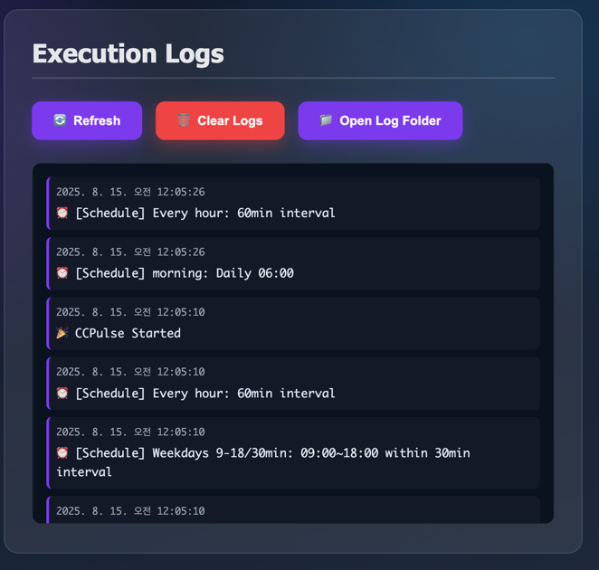

# CCPulse 💙

> Keep your Claude Code token window alive with periodic pulses

[](https://opensource.org/licenses/MIT)
[](https://github.com/renechoi/ccpulse)
[](https://nodejs.org)
[](https://github.com/renechoi/ccpulse)

<!-- Screenshots -->
<p>
  
</p>
<p>
  
</p>
<p>
  
</p>

## 🌍 Language

[한국어](README.ko.md) | **English**

## 🚀 Quick Start (30-second install)

### macOS/Linux
```bash
curl -fsSL https://raw.githubusercontent.com/renechoi/ccpulse/main/install.sh | bash
```

### Windows
```powershell
iwr -useb https://raw.githubusercontent.com/renechoi/ccpulse/main/install.ps1 | iex
```

### Manual Installation
```bash
git clone https://github.com/renechoi/ccpulse.git
cd ccpulse
npm install
npm start
```

## 💡 Why Do You Need This?

Claude Code uses a **5‑hour token window** that starts from your first usage:
- First use at 3 PM → Window ends at 8 PM (5 hours)
- First use at 6 AM → Window ends at 11 AM (5 hours)

**The Solution**: Automatically send a minimal "Hello" pulse at your preferred time (e.g., 6:00 AM) so your 5‑hour window starts when you want (e.g., aligned with working hours).

## ✨ Key Features

- 🕐 **Schedule Management**: Auto-run at your preferred time
- 🎨 **GUI Interface**: Easy configuration with visual interface
- 🌐 **Multi-language**: English/Korean support with easy switching
- 📊 **Real-time Logs**: Monitor execution status
- 🔄 **Mock/Real Modes**: Test safely before actual execution
- 🖥️ **System Tray**: Runs quietly in background
- ⚡ **Multiple Schedules**: Set multiple trigger times
- 🔔 **Notifications**: Get alerts on successful resets

## 📖 How to Use

### 1. Initial Setup
- **Pulse Time**: 6:00 AM (example)
- **Message**: "Hello" (customizable)
- **Mode**: Start with Mock mode → Switch to Real mode
- **Language**: Click the language button to switch

### 2. Running the App
```bash
# From project directory
npm install
npm start

# (Optional) Double-click desktop shortcut if you created one
```

### 3. Configuration Locations
- macOS: `~/Library/Application Support/ccpulse/`
- Linux: `~/.config/ccpulse/`
- Windows: `%APPDATA%/ccpulse/`

## 🛠️ Advanced Configuration

### Auto-start Setup
```bash
# macOS
launchctl load ~/Library/LaunchAgents/com.claude.ccpulse.plist

# Linux
systemctl --user enable ccpulse.service

# Windows
# Automatically added to startup programs
```

### Environment Variables
```bash
export CCPULSE_MOCK_MODE=false    # Force Real mode
export CCPULSE_AUTO_START=true    # Enable auto-start
export CCPULSE_LANGUAGE=en        # Set default language (en/ko)
```

### Command Line Options
> Global CLI is not bundled yet. Use the UI or edit schedules in the app.

## 📋 Requirements

- Node.js 16.0.0 or higher
- Claude Code installed and configured
- macOS: Terminal automation permission required

## 🤝 Contributing

Contributions are welcome! Please feel free to submit a Pull Request.

1. Fork the repository
2. Create your feature branch (`git checkout -b feature/AmazingFeature`)
3. Commit your changes (`git commit -m 'Add some AmazingFeature'`)
4. Push to the branch (`git push origin feature/AmazingFeature`)
5. Open a Pull Request

### Development Setup
```bash
# Clone and install
git clone https://github.com/renechoi/ccpulse.git
cd ccpulse
npm install

# Run in development mode
npm run dev

# Run tests
npm test

# Build for production
npm run build
```

## 📝 License

MIT License © 2025 [renechoi](https://github.com/renechoi)

## 🆘 Troubleshooting

### macOS Permission Issues
```bash
# Allow Terminal automation access
System Preferences > Privacy & Security > Automation > Terminal ✓
```

### Node.js Installation
```bash
# macOS
brew install node

# Ubuntu/Debian
curl -fsSL https://deb.nodesource.com/setup_lts.x | sudo -E bash -
sudo apt-get install -y nodejs

# Windows
# Download from https://nodejs.org
```

### View Logs
```bash
# Real-time log monitoring
tail -f ~/.config/ccpulse/logs.txt

# Check last 50 lines
tail -n 50 ~/.config/ccpulse/logs.txt
```

### Common Issues

<details>
<summary>App doesn't start on macOS</summary>

If you see "App can't be opened because it is from an unidentified developer":
```bash
xattr -cr /Applications/CCPulse.app
```
</details>

<details>
<summary>Schedule not triggering</summary>

1. Check if the app is running in system tray
2. Verify schedule time in settings
3. Ensure Mock mode is disabled for actual execution
4. Check logs for any error messages
</details>

## 📊 How It Works


### Execution timing
- After sending the message to Claude, CCPulse waits 10 seconds before sending exit.
- Rationale: Claude TUI may need a few seconds to register the first turn; this buffer prevents the session from closing too early.

## 🔗 Links

- [Report Issues](https://github.com/renechoi/ccpulse/issues)
- [Wiki Documentation](https://github.com/renechoi/ccpulse/wiki)
- [Latest Releases](https://github.com/renechoi/ccpulse/releases)
- [Discussions](https://github.com/renechoi/ccpulse/discussions)

## ⭐ Star History

[](https://star-history.com/#renechoi/ccpulse&Date)

---

<p align="center">
  Made with ❤️ for the Claude community
  <br>
  <a href="https://github.com/renechoi/ccpulse">⭐ Star us on GitHub!</a>
</p>